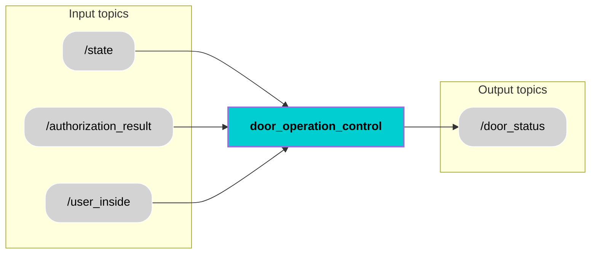

<div align="center">
  <h1 style="font-size: 36px;">Door Operation Control</h1>
</div>


## 📚 Contents
- [Description](#-description)
- [Architecture](#-architecture)
- [Interfaces](#-interfaces)
- [User Stories ](#-user-stories)
- [Installation](#-installation)
- [Usage](#-usage)
- [Contributor](#-contributor)
- [License](#-license)

## 🧠 Description
The Door Operation Control component is responsible for managing the autonomous shuttle’s door behavior during boarding and dropoff & deboarding states. It processes `/state`, `/user_inside`, and `/authorization_result` topics to determine when the door should open or close.The component handles two primary operational scenarios.
During boarding state, the door opens only when the user is outside the shuttle and a valid user authorization signal is received.During dropoff & deboarding state, the door opens automatically upon entering to dropoff & deboarding state and remains open for 120 seconds to allow safe exiting. After this timeout, the door closes and remains closed.The Door Operation Control component also publishes door status continuously to `/door_status` topic and immediate updates when the status changes for reliable communication within the system.

Functionally, the component controls door opening and closing behaviour based on shuttle's state, user presence, and authorization during boarding and dropoff & deboarding state.


## 🧩 Architecture


## 🔌 Interfaces

### Topics:
| Name                         | IO      | Type                 | Description                                                              |
|------------------------------|---------|----------------------|--------------------------------------------------------------------------|
| `/state`        | Input   | `std_msgs/msg/Int32.msg`      |  Provides the current state of the shuttle : `0 = IDLE , 1 = DRIVING AND PLANNING , 2 = BOARDING , DROPOFF AND DEBOARDING = 3 , PARKING = 4`.|
| `/authorization_result`         | Input   | `std_msgs/msg/Bool.msg`      | Provides a boolean indicating whether the user is authorized`(True)` or not authorized`(False)`.                 |
| `/user_inside`        | Input   | `std_msgs/msg/Bool.msg`      |Provides a boolean indicating whether the user is inside`(True)` the shuttle or not`(False)`.|
| `/door_status`           | Output  |`std_msgs/msg/Bool.msg`    | 	Provides a boolean indicating whether the shuttle's door is open`(True)` or close`(False)`. |

### State Definations:
| State ID          | State Name                                                              |
|------------------------------|------------------------------------------------------------------------------------------------------|
| 0  |  IDLE |
| 1  | DRIVING AND PLANNING |
| 2  | BOARDING |
| 3 | DROPOFF AND DEBOARDING|
| 4    |  PARKING|

### Door Operation Control Logic:
| Conditions         | Action                                                              |
|------------------------------|------------------------------------------------------------------------------------------------------|
| `/state = 2` and `/user_inside = False` and `/authorization_result = True`   |  Open door and publish `/door_status = True`  |
| `/state = 2` and `/user_inside = False` and `/authorization_result = False`  | Keep door closed and publish `/door_status = False`  |
| `/state = 2` and `/user_inside = True`    | Close door and publish `/door_status = False`  |
| `/state = 3` | Open door and publish `/door_status = True` |
| `/state = 3` and `120 seconds passed since door opened in state 3` and        |  Close door and publish `/door_status = False`|

### Custom messages:
There are no custom messages used for this component.


## 🎯 User Stories 
[US 4.3](https://miro.com/app/board/uXjVI9mh4O0=/?moveToWidget=3458764649947645910&cot=14) : Door Opening and Closing During Boarding State

[US 7.3](https://miro.com/app/board/uXjVI9mh4O0=/?moveToWidget=3458764649948217507&cot=14) : Door Opening and Closing During Dropoff & Deboarding State

## 🛠️ Installation
1. Create workspace, src and go to src
```bash
mkdir temp_ws
cd temp_ws
mkdir src
cd src
```
2. Clone component repository
```bash
git clone https://git.hs-coburg.de/pax_auto/door_operation_control.git
```
3. Return to workspace and build the package
```bash
cd ..
colcon build
```
4. Source the setup files
```bash
source install/setup.bash
```


## ▶️ Usage
Run the node: 

```bash 
ros2 run door_operation_control door_node
``` 

## 🧑‍💻 Contributor
[Harsh Mukeshbhai Bhadani](https://git.hs-coburg.de/harshbhadani) 

## 🔒 License
Licensed under the **Apache 2.0 License**. See [LICENSE](LICENSE) for details.  

